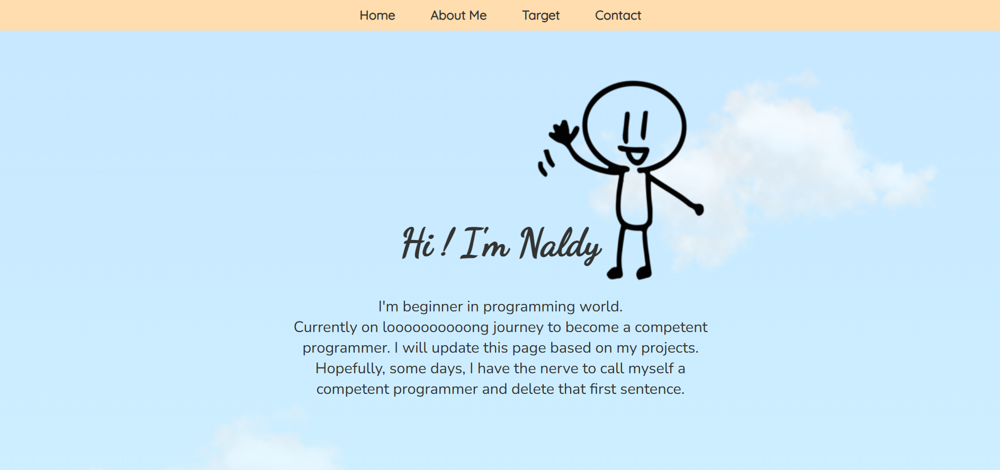

# Personal Landing Page

This repository is designated for my own personal landing page. This page utilizing only HTML & CSS. The landing page itself will be updated based on my future projects.

## Preview



## How to Run this Project

Feel free to modify the code and made your own landing page if you are interested in it.

1. Clone this project
```
git clone https://github.com/mdavindarinaldy/mdavindarinaldy.github.io
```
2. Install dependencies
```
npm install
``` 
3. Run the project
```
npm run dev
```
4. Project will running on http://localhost:8080

## Dependencies
This project using node.js to run, make sure to install node on your machine. Other than that, this project also using live-server to mock http local server environment.

## Basic Information
This project is part of training program at Kodacademy Bootcamp Batch 24 made by Muhammad Davinda Rinaldy